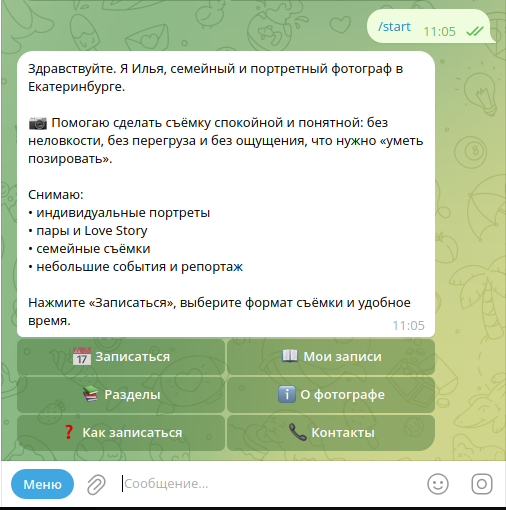
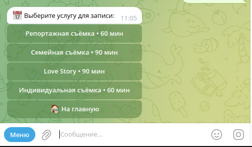
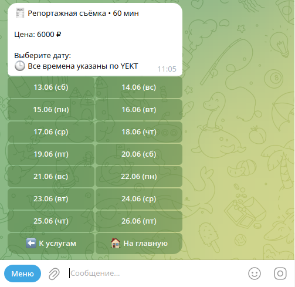
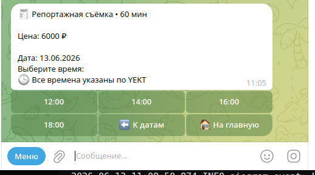
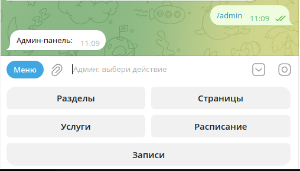

# Telegram Booking Bot


## О проекте

**Telegram Booking Bot** — продуктовая реализация Telegram-бота для записи клиентов на услуги.

Проект собран на базе переиспользуемого [Modular Telegram Bot Template](https://github.com/yuri586/modular-telegram-bot-template) и показывает, как из общей платформенной основы можно собрать конкретный коммерческий сценарий: выбор услуги, выбор свободного времени, создание записи, уведомления, админка услуг и расписания.

Это не универсальный framework для любых Telegram-ботов, а прикладной booking-продукт, который можно адаптировать под разные ниши:

- фотограф
- психолог
- репетитор
- консультант
- мастер услуг
- специалист с расписанием и записью клиентов

## Screenshots

### Главное меню



### Выбор услуги



### Выбор даты



### Выбор времени



### Админ-панель



## Что умеет бот

Пользовательский сценарий:

- просмотр услуг
- выбор услуги
- выбор свободного слота
- отправка телефона
- создание записи
- просмотр активных записей
- отмена записи
- получение уведомлений по записи

Админский сценарий:

- управление услугами
- управление слотами
- массовое создание слотов
- генерация слотов по диапазону дат и дням недели
- копирование расписания с одного дня на другой
- просмотр записей
- изменение статусов записей
- статусы оплаты для записей
- настройка напоминаний перед встречей
- CSV export
- рассылка активным клиентам
- Telegram CMS для контентных страниц и разделов

## Demo profiles

В проекте есть несколько демо-профилей:

- `photographer`
- `psychologist`
- `tutor`

Они показывают, как один booking engine можно адаптировать под разные ниши.

Demo profiles задают:

- тексты
- UI labels
- demo content
- demo services
- demo time slots

## Demo data note

Все имена, контакты, цены, тексты, профили и бизнес-сценарии в этом репозитории являются демонстрационными.

Они нужны для портфолио, локальной разработки и проверки сценариев.  
Они не являются реальными клиентскими данными.

## Технологический стек

- Python 3.11
- aiogram 3
- SQLAlchemy async
- Alembic
- SQLite для локальной разработки
- pytest
- Ruff
- Telegram Bot API

## Архитектура

Проект построен вокруг нескольких слоёв:

```text
core + plugins + profiles
```

### Core

Базовая инфраструктура:

* запуск приложения
* конфигурация
* база данных
* middleware
* logging
* startup smoke-check
* Telegram CMS

### Booking plugin

Booking plugin отвечает за:

* услуги
* слоты
* записи
* статусы
* уведомления
* admin booking workflows
* bulk slot tools
* CSV export
* broadcast

### Profiles

Profiles задают нишу и демо-контент.

Один и тот же booking engine может использоваться с разными профилями.

## Быстрый старт

### 1. Создать виртуальное окружение

```bash
python3 -m venv venv
source venv/bin/activate
python -m pip install --upgrade pip
python -m pip install -r requirements.txt
```

### 2. Создать `.env`

```bash
cp .env.example .env
```

Минимально нужно указать:

```env
TOKEN=123456:ABCDEF...
ADMIN_IDS=123456789
```

Пример `.env` для booking demo:

```env
TOKEN=123456:ABCDEF...
ENV=dev
DB_URL=sqlite+aiosqlite:///./db.sqlite3

ADMIN_IDS=123456789

DEMO_PROFILE=photographer
SEED_DEMO=1

ENABLE_BOOKING=1
ENABLE_LEADS=0
ENABLE_SHOP=0
ENABLE_GROUPS=0

BOOKING_TIMEZONE=UTC

DEBUG_SQL=0
LOG_LEVEL=INFO
```

### 3. Применить миграции

```bash
alembic upgrade head
```

### 4. Проверить smoke-сборку

```bash
DEMO_PROFILE=photographer \
SEED_DEMO=0 \
ENABLE_BOOKING=1 \
ENABLE_LEADS=0 \
ENABLE_SHOP=0 \
ENABLE_GROUPS=0 \
ADMIN_IDS=123456789 \
python app.py --smoke
```

Ожидаемый результат:

```text
SMOKE OK
```

### 5. Запустить бота

```bash
python app.py
```

## Demo profile запуск

Первый запуск с demo seed:

```bash
SEED_DEMO=1 DEMO_PROFILE=photographer ENABLE_BOOKING=1 python app.py
```

После первичного заполнения базы:

```bash
SEED_DEMO=0 DEMO_PROFILE=photographer ENABLE_BOOKING=1 python app.py
```

Для другого demo profile лучше использовать новую пустую базу или другой `DB_URL`.

Пример миграции для отдельной базы:

```bash
DB_URL=sqlite+aiosqlite:///./psychologist.sqlite3 alembic upgrade head
```

## Переменные окружения

| Переменная         | Назначение                              | Пример                             |
| ------------------ | --------------------------------------- | ---------------------------------- |
| `TOKEN`            | Telegram bot token                      | `123456:ABCDEF...`                 |
| `ENV`              | Режим окружения                         | `dev`                              |
| `DB_URL`           | URL базы данных                         | `sqlite+aiosqlite:///./db.sqlite3` |
| `ADMIN_IDS`        | Telegram ID админов через запятую       | `123456789`                        |
| `DEMO_PROFILE`     | Активный demo profile                   | `photographer`                     |
| `SEED_DEMO`        | Заполнять БД demo data при старте       | `0` или `1`                        |
| `ENABLE_BOOKING`   | Включить booking plugin                 | `1`                                |
| `ENABLE_LEADS`     | Отключить lead plugin для booking demo  | `0`                                |
| `ENABLE_SHOP`      | Отключить shop plugin для booking demo  | `0`                                |
| `ENABLE_GROUPS`    | Отключить group plugin для booking demo | `0`                                |
| `BOOKING_TIMEZONE` | Timezone для бизнес-логики записи       | `UTC`                              |
| `DEBUG_SQL`        | SQL logging                             | `0`                                |
| `LOG_LEVEL`        | Уровень логирования                     | `INFO`                             |

## Миграции

Применить миграции:

```bash
alembic upgrade head
```

Создать новую миграцию после изменения моделей:

```bash
alembic revision --autogenerate -m "describe change"
alembic upgrade head
```

## Проверки

```bash
python -m compileall -q .
ruff check .
python -m pytest -q

DEMO_PROFILE=photographer \
SEED_DEMO=0 \
ENABLE_BOOKING=1 \
ENABLE_LEADS=0 \
ENABLE_SHOP=0 \
ENABLE_GROUPS=0 \
ADMIN_IDS=123456789 \
python app.py --smoke
```

## Структура проекта

```text
app.py
config.py
alembic/
common/
database/
filters/
handlers/
keyboards/
middlewares/
plugins/
profiles/
tests/
utils/
```

Ключевые директории:

* `plugins/booking/` — booking product logic
* `profiles/` — demo profiles
* `database/` — SQLAlchemy models and ORM helpers
* `handlers/` — base user/admin/CMS handlers
* `alembic/` — database migrations
* `tests/` — automated tests

## Связь с base template

Этот проект является продуктовой реализацией, собранной поверх переиспользуемой базы Telegram-ботов на aiogram 3.

[Modular Telegram Bot Template](https://github.com/yuri586/modular-telegram-bot-template) показывает общую архитектуру.

Отдельная установка base template не требуется: этот репозиторий запускается самостоятельно.

Booking Bot показывает конкретный коммерческий сценарий записи клиентов: услуги, слоты, записи, админские сценарии, уведомления и демо-профили.

## Ограничения

Этот репозиторий не является:

* SaaS-сервисом
* CRM-системой
* e-commerce bot
* универсальным framework
* готовым boxed-product для всех ниш без адаптации

Это portfolio-ready booking implementation, которую можно доработать под конкретного специалиста или бизнес-сценарий.
